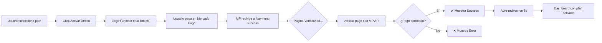

# ✅ Página de Confirmación de Pago - Completada

## Cambios Realizados

### 1. **Componente PaymentSuccessPage** 
Archivo: [`components/PaymentSuccessPage.tsx`](file:///c:/Users/54112/Desktop/GestionPro/components/PaymentSuccessPage.tsx)

**Características:**
- ✅ Verificación automática del pago al cargar
- ✅ 3 estados visuales: Verificando / Éxito / Error
- ✅ Countdown de 5 segundos para redirección automática
- ✅ Muestra detalles del plan seleccionado
- ✅ Próxima fecha de cargo
- ✅ Diseño moderno con gradientes y animaciones

---

### 2. **Integración en App.tsx**
Archivo: [`App.tsx`](file:///c:/Users/54112/Desktop/GestionPro/App.tsx)

**Cambios:**
- ✅ Importado componente `PaymentSuccessPage`
- ✅ Detecta automáticamente cuando la URL contiene `/payment-success` o `external_reference`
- ✅ Muestra la página de confirmación sin requerir autenticación
- ✅ Botón "Ir al Dashboard" limpia la URL y vuelve a la app

---

### 3. **Edge Function Actualizada**
Archivo: [`supabase/functions/create-subscription/index.ts`](file:///c:/Users/54112/Desktop/GestionPro/supabase/functions/create-subscription/index.ts)

**Cambio en `back_url`:**
```typescript
back_url: `https://gestionnow.site/payment-success?external_reference=${external_reference}`
```

Ahora redirige a la página de confirmación con el ID de referencia para verificar el pago.

---

## Flujo Completo de Suscripción



---

## URL de Configuración en Mercado Pago

En el campo **"¿A dónde querés redireccionara tu cliente?"**, debes ingresar:

```
https://gestionnow.site/payment-success
```

> [!IMPORTANT]
> Asegúrate de que tu dominio apunte correctamente a la aplicación desplegada.

---

## Testing Local

Para probar localmente antes de deployment:

1. **Modificar temporalmente** el `back_url` en [`create-subscription/index.ts`](file:///c:/Users/54112/Desktop/GestionPro/supabase/functions/create-subscription/index.ts):

```typescript
back_url: `http://localhost:3000/payment-success?external_reference=${external_reference}`
```

2. **Reiniciar el servidor**:
```bash
npm run dev
```

3. **Probar el flujo**:
   - Ir a Configuración → Mi Suscripción
   - Seleccionar un plan
   - Completar el pago
   - Deberías volver a `localhost:3000/payment-success`

4. **Antes de desplegar** a producción, cambiar denuevo el back_url a `https://gestionnow.site/payment-success`

---

## Próximos Pasos

### ⚠️ Pendientes
1. **Redesplegar Edge Function** con la nueva URL de retorno:
   - Opción A: Desde Supabase Dashboard (copiar código actualizado)
   - Opción B: Si instalas Supabase CLI después

2. **Configurar URL en Mercado Pago**:
   - Panel → Tu aplicación → Webhooks/URLs
   - Agregar: `https://gestionnow.site/payment-success`

3. **Probar flujo completo** con dinero real

---

## Capturas de Estados

### Estado: Verificando
- Loader animado amarillo
- Mensaje: "Verificando Pago..."

### Estado: Éxito ✅
- Ícono verde con bounce
- Detalles del plan
- Countdown de redirección
- Botón "Ir al Dashboard"

### Estado: Error ❌
- Ícono rojo
- Opciones: "Reintentar" o "Volver al Inicio"
- Código de referencia para soporte

---

## Notas Técnicas

- **Sin dependencia de React Router**: Usa `window.location` y `window.history`
- **No requiere autenticación**: La página se muestra antes del login
- **Verificación automática**: Llama a `verifySubscriptionPayment` del store
- **Responsive**: Funciona en mobile y desktop
