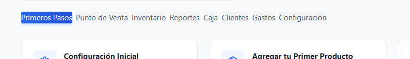

# Tutorial: Cerrar la Caja al Final del Día

## Objetivo
Realizar el cierre de caja, contar el efectivo y cuadrar las ventas del día.

---

## ¿Cuándo cerrar la caja?

- ✅ Al finalizar la jornada laboral
- ✅ Antes de cambiar de turno (ej: mañana → tarde)
- ✅ Cada vez que quieras hacer un arqueo de efectivo

---

## Pasos Detallados

### 1. Ir a Cierre de Caja

- Menú lateral → **"Cierre de Caja"**
- Verás el resumen de la sesión actual

<!-- SCREENSHOT: media__1771387343584.png -->

**Información visible:**
- 💵 Monto inicial
- 💰 Total vendido en efectivo
- 💳 Total en tarjetas/digital
- 📊 Cantidad de ventas realizadas

---

### 2. Hacer Clic en "Cerrar Sesión"

- Busca el botón **"Cerrar Sesión"** (generalmente rojo o en la esquina)
- Haz clic

> ⚠️ **Advertencia**: Una vez cerrada, no podrás vender hasta abrir nueva sesión

<!-- SCREENSHOT: media__1771387343584.png -->

---

### 3. Contar el Efectivo Físico

**Antes de ingresar datos en el sistema:**

1. **Cierra la caja registradora**
2. **Cuenta todo el efectivo**:
   - Billetes de $1000, $500, $200, $100, etc.
   - Monedas de $10, $5, $2, $1, etc.
3. **Anota el total** (puedes usar calculadora)

> 💡 **Tip**: Separa los billetes por denominación para contar más rápido

<!-- SCREENSHOT: media__1771387343584.png -->

---

### 4. Ingresar Efectivo Contado

En el formulario de cierre, verás:

| Campo | Qué Significa | Ejemplo |
|-------|---------------|---------|
| **Efectivo Contado** | Lo que hay físicamente en la caja | $23.450 |
| **Efectivo Esperado** | Lo que debería haber según el sistema | $23.500 |
| **Diferencia** | Se calcula automáticamente | -$50 (falta) |

**Ingresa el monto que contaste:**
- Escribe el total exacto: $23.450

<!-- SCREENSHOT: media__1771387343584.png -->

---

### 5. Interpretar la Diferencia

El sistema compara automáticamente:

**Si la diferencia es $0:**
- ✅ **Perfecto!** Todo cuadra
- El efectivo coincide con las ventas

**Si hay diferencia positiva (+$50):**
- 💰 **Sobra dinero**
- Posibles causas: Error al dar vuelto, venta no registrada

**Si hay diferencia negativa (-$50):**
- ⚠️ **Falta dinero**
- Posibles causas: Diste de más en vuelto, retiro no registrado

<!-- SCREENSHOT: media__1771387343584.png -->

---

### 6. Agregar Observaciones (Opcional)

Si hay diferencia o algo inusual:

1. En el campo **"Observaciones"** o **"Notas"**
2. Escribe la explicación:
   - "Retiro de $1000 para pago a proveedor"
   - "Error en vuelto detectado en venta #234"
   - "Diferencia menor, posiblemente monedas"

<!-- SCREENSHOT: media__1771387343584.png -->

---

### 7. Confirmar Cierre

1. Revisa todos los datos
2. Haz clic en **"Confirmar Cierre"** o **"Cerrar Caja"**
3. Espera confirmación: ✅ "Sesión cerrada exitosamente"

<!-- SCREENSHOT: media__1771387343584.png -->

---

### 8. Ver o Descargar Reporte

Después del cierre:

**Se genera automáticamente un reporte con:**
- 📄 Resumen de ventas del día
- 💵 Desglose por método de pago
- 📊 Total de ingresos y egresos
- 🧾 Lista de todas las ventas
- ✍️ Firma digital del responsable

**Acciones disponibles:**
- 🖨️ **Imprimir**: Para archivar físicamente
- 💾 **Descargar PDF**: Guardar en carpeta
- 📧 **Enviar Email**: Al administrador

<!-- SCREENSHOT: media__1771387343584.png -->

---

### 9. Retirar el Efectivo (Recomendado)

**Para seguridad:**
1. Deja solo el monto inicial para el día siguiente
2. Lleva el excedente a una caja fuerte o banco
3. Registra el retiro en el sistema

**Ejemplo:**
- Efectivo contado: $23.450
- Monto inicial de mañana: $5.000
- **Retiro para depositar**: $18.450

---

## ✅ Verificación

El cierre fue exitoso cuando:

- [x] El efectivo está contado y anotado
- [x] La diferencia está justificada (o es $0)
- [x] El reporte se guardó o imprimió
- [x] El POS está nuevamente bloqueado
- [x] El excedente se retiró de manera segura

---

## 🎯 Próximos Pasos

Después del cierre:

1. **Revisa el reporte** para detectar tendencias
2. **Deposita el efectivo** en el banco al día siguiente
3. **[Consulta reportes históricos](./08_reportes.md)** para análisis

---

## ❓ Preguntas Frecuentes

**P: ¿Qué hago si hay una gran diferencia?**  
R: Revisa las ventas del día, verifica si registraste todos los retiros, y cuenta nuevamente el efectivo.

**P: ¿Puedo cerrar sin contar el efectivo?**  
R: Técnicamente sí, pero NO es recomendable. Siempre cuenta físicamente.

**P: ¿Qué pasa si cierro por error?**  
R: Debes abrir una nueva sesión. Los datos del cierre anterior quedan guardados.

**P: ¿Puedo ver cierres de días anteriores?**  
R: Sí, en "Cierre de Caja" hay un historial de todas las sesiones cerradas.

**P: ¿El sistema registra quién cerró la caja?**  
R: Sí, queda guardado tu usuario, fecha y hora exacta del cierre.
